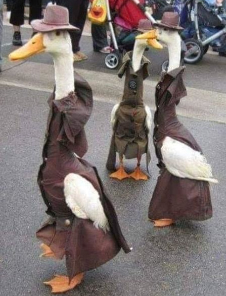
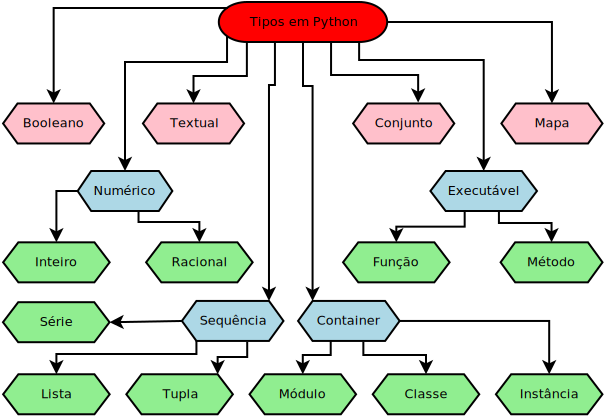

.. _modulo_tipo:

Tipos na Linguagem Python
============================

Um conceito central do Python é que todos os valores são caracterizados por um tipo.
A tipagem forte significa que o tipo de um objeto não muda de forma inesperada.
Uma string contendo apenas dígitos não se torna magicamente um número,
como pode acontecer em linguagens de tipagem fraca como JavaScript e Perl.
Cada mudança de tipo requer uma conversão de tipo explícita (aka casting).

Outra ideia interessante no Python é o que é conhecido como *duck typing* ou tipagem do pato.
Este modelo de tipagem não exige uma correspondencia absoluta entre os tipos de valores para
se usar as capacidades do tipo. Ou seja, podemos fazer um nome apontar para valores com tipos
semelhantes e o código vai funcionar. Se nada como um pato, anda como um pato e grasna como
um pato então podemos considerar que é um pato.

Os tipos da linguagem Python

.. code-block:: python

    tom = "um gato" # aqui o nome tom foi colocado para identificar o texto -um gato-
    jerry = "um rato" # aqui jerry indentifica o texto -um rato-
    num_bichos = 2 # onome num_bichos identifica o valor 2
    print("O desenho tem ", num_bichos, 'personagens: ' tom, "e ", jerry)
    # O texto impresso será: -O desenho tem 2 personagens: um gato e um rato-

A expressão *tom = "um gato"* quer dizer: use o nome *tom* para se referenciar ao texto *um gato*.
Diferentemente do uso em matemática o símbolo *=* não quer dizer igualdade.
No Python, o símbolo igual (**=**) quer dizer: atribua ao nome *tom* o valor *um gato*.
Em todo lugar que você colocar o nome tom, o Python vai substituir pelo seu valor *um gato*.
Funciona como na comunicação internet, onde você usa o emoji 😀 e o leitor entende que você na verdade
escreveu: *isto é engraçado*.
A expressão *<um nome> = <um valor>* no Python é chamada de atribuição.
Com ela declaramos que doravante este nome representa este valor indicado.

.. note::
    É importante ressaltar que um nome só poderá ser usado no programa se antes ele foi atribuído a um valor.

Existe umas regras de boas maneiras para escolher e escrever um nome em Python.
Estas regras foram definidas pela `Python Software Foundation <https://www.python.org/psf/>`_
em um documento chamado `PEP8 <https://peps.python.org/pep-0008/>`_.

Em sua maior parte os nomes devem ser escritos em letras minúsculas com as palavras separadas
pelo caracter *sublinhado(_)* por exemplo: *meu_gato*. Se o nome for se referir a uma constante,
isto é, se o seu valor nunca será trocado em todo o programa, então todas as letras serão em caixa alta.
Por exemplo *PT_BR = "Português do Brasil"*. Caso você vá definir um tipo novo que você criou,
a norma é usar o **PascalCase** ou **UpperCamelCase**, com todas as palavras grudadas e começadas em caixa alta.
Por exemplo, a palavra *class* em Python é usada para criar um tipo novo: *class GatoFrajola: <continua..>*

.. raw:: html

  

  

.. moduleauthor:: Carlo Oliveira <carlo@nce.ufrj.br>

.. note::
   Procure ser cooperativo com a sua equipe.
